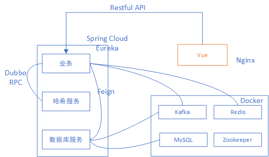
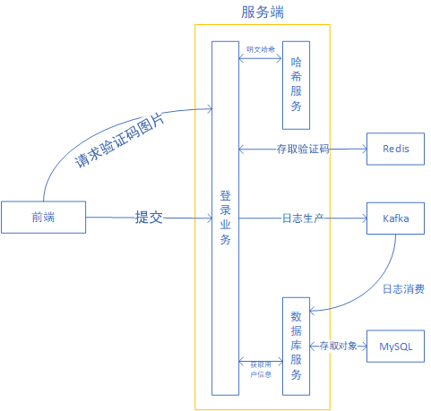

### 技术列表
1. Spring Boot
2. Spring Cloud
    - Feign  --- 声明式、模板化的 HTTP 客户端
    - Eureka --- Spring Cloud 的注册中心   
3. Mybatis-plus --- ORM 框架，可以快速生成 Entity、Mapper、Mapper XML、Service、Controller 等各个模块的代码
4. Dubbo --- RPC 框架，需要配合 Zookeeper 一起使用
5. Zookeeper --- 一个注册中心和 Eureka 功能一致，可以负载均衡，可以部署集群，使用 Docker 部署
6. Kafka --- 消息队列，需要配合 Zookeeper 一起使用
7. MySQL --- 常见的关系数据库，使用 Docker 部署
8. Redis --- 常见的高速缓存 NoSQL 数据库，使用 Docker 部署
9. Vue --- 常见的前端框架
10. Nginx --- 常见的服务器
11. Docker --- 容器

### 具体实现
#### 架构图

#### 业务图

